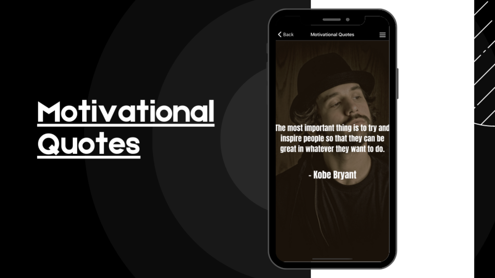

# Motivational Quotes App

## Table of Contents
- [Installation](#installation)
- [App Features](#app-features)
- [Contributing](#contributing)
- [Conclusion](#conclusion)

## Introduction

:warning: This is a ongoing project, some features will be implemented in the future.

Motivational Quotes is a React Native app that displays motivational quotes to inspire users. The app allows users to read through a curated list of quotes and also allows them to add new quotes to the list. In this documentation, we will go through the installation process, app features, and how to contribute to the project.

## Installation

To install the "Motivational Quotes" app, follow the steps below:

#### npm

1. Clone the repository from GitHub using the following command:
`git clone https://github.com/alanhcrdz/motivational-quotes.git`
2. Navigate to the project directory using the following command:
`cd motivational-quotes`
3. Install the project dependencies by running the following command:
`npm install`
4. Start the app by running the following command:
`npx expo start`

5. Once the app is started, you can run it on an Android or iOS simulator or on a physical device.

## App Features

The "Motivational Quotes" app has the following features:

1. Home Screen: The home screen displays a list of motivational quotes that users can scroll through. Users can also pull down on the screen to refresh the list.

2. Details Quote Screen: The app allows users to see the quites within a picture in a detailed view, image will have full size here.

3. Favorite Quotes Screen: The app also has a "Favorite Quote" screen that allows users to see  quotes they marked as favorite. The list of favirited quotes will be marked with a  :heart: icon. Users can also unfavorite a selected quote

4. Share Quote: Users can share quotes with their friends via social media or messaging apps.

## Contributing

If you'd like to contribute to Barber Master, please follow these steps:

1. Fork the repository
2. Create a new branch (git checkout -b new-feature)
3. Make your changes and commit them (git commit -am 'Add new feature')
4. Push to the branch (git push origin new-feature)
5. Create a new Pull Request

## Conclusion

"Motivational Quotes" is a simple but effective app that provides inspiration to users. The app is built using React Native and is open source, which means anyone can contribute to it. If you have any suggestions for the app or would like to contribute to the project, feel free to do so by following the steps outlined above.